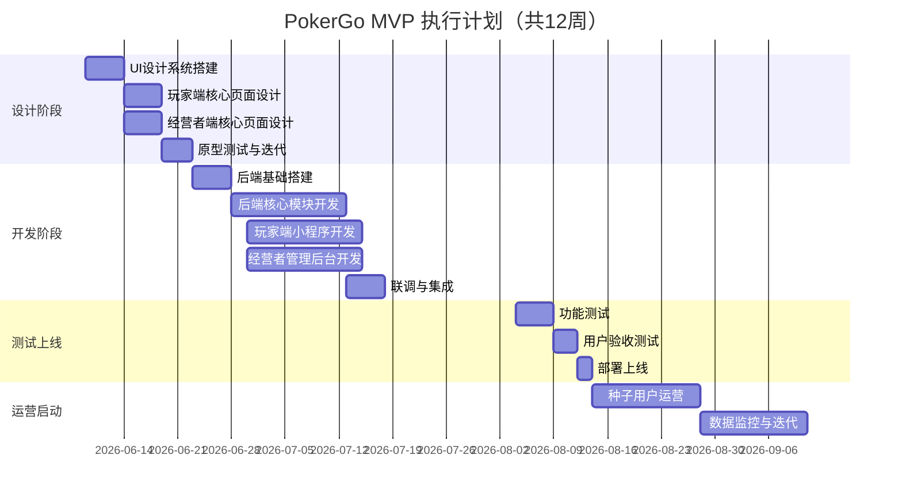

# PokerGo MVP 全流程执行计划

基于已完成的四份核心文档（MVP产品需求文档V2.3、技术架构设计V2.0、产品调研文档V1.2、UI/UX设计方案V1.0），制定从设计到运营的完整执行计划。

## 总体时间线

> [!IMPORTANT]
> 总工期预估 **12 周**（2026.06.09 ~ 2026.08.31），其中设计与开发有 1 周重叠期。MVP 上线目标：**2026年8月中旬**。

---

## Phase 1：设计阶段（第1-2周）

### 目标
完成 Figma Design System + 核心页面高保真设计稿 + 可点击原型

### 1.1 Design System 搭建（Day 1-5）

| 任务 | 产出 | 依据文档 |
|------|------|---------|
| 创建 Figma 项目结构 | 组件库 + 页面模板 | UI/UX设计方案 §4 |
| 定义 Design Token（色彩/字体/间距/圆角） | Token 变量集 | UI/UX设计方案 §4.2-4.5 |
| 搭建 6 套主题色板 | 暗夜紫金/精酿暖棕/霓虹赛博/简约白/中国红/海岸蓝 | UI/UX设计方案 §8.2 |
| 基础组件设计（Button/Card/Input/Tab/Toast） | 20+ 基础组件 | UI/UX设计方案 §4.6-4.7 |
| 图标集整理（Phosphor + 自定义业务图标） | SVG 图标库 | UI/UX设计方案 §4.7 |

### 1.2 玩家端小程序页面设计（Day 4-10）

| 页面 | 优先级 | 关键设计点 |
|------|--------|-----------|
| 门店首页 | P0 | 多主题适配、门店信息+活动列表+排行榜预览 |
| 活动详情+报名 | P0 | 报名流程极简（姓名+手机号）、名额进度条 |
| 酒水点单+购物车 | P0 | 分类 Tab + 商品卡片 + 底部购物车浮层 |
| 排行榜 | P1 | 竞技感设计、名次动效 |
| 我的（个人中心） | P1 | 积分/成绩/订单入口 |
| 知识库列表+详情 | P2 | 内容阅读体验 |

### 1.3 经营者管理后台页面设计（Day 4-10）

| 页面 | 优先级 | 关键设计点 |
|------|--------|-----------|
| 工作台（Dashboard） | P0 | 核心指标卡片 + 快捷操作 + 待处理事项 |
| 创建活动 | P0 | 大表单设计、盲注模板选择 |
| 订单管理 | P0 | 状态 Tab + 滑动操作 + 实时提醒 |
| 开店向导（4步） | P0 | Step by step、引导式设计 |
| 经营设置（经营模式） | P0 | 模板选择 + 规则配置 |
| 商品管理 | P1 | CRUD + 分类 + 排序拖拽 |
| 品牌主题设置 | P1 | 主题预览 + 取色器 |
| 会员列表 | P2 | 搜索 + 脱敏手机号 |

### 1.4 原型测试（Day 9-12）

| 任务 | 方法 | 对象 |
|------|------|------|
| 可点击原型搭建 | Figma Prototype | — |
| 玩家端任务测试 | 5人测试（报名+下单+看排行） | 德扑爱好者 |
| 经营者端任务测试 | 5人测试（开店向导+发活动+确认订单） | 潜在酒馆老板 |
| 收集反馈并迭代 | 修改设计稿 | — |

---

## Phase 2：开发阶段（第3-8周）

### 2.1 后端基础搭建（Week 3）

| 任务 | 详情 | 产出 |
|------|------|------|
| Clone ruoyi-vue-pro 并裁剪 | 删除 BPM/CRM/MP 等不需要的模块，保留 framework + system + infra | 干净的脚手架 |
| 创建业务模块骨架 | yudao-module-club/event/product/order/player/knowledge/compliance/leaderboard/notification/auth | Maven 多模块结构 |
| 数据库初始化 | 导入 system.sql + 创建业务表（club/user/event/registration/result/product/order/club_business_config/recharge_record/points_log） | MySQL 表结构就绪 |
| 基础配置 | application-dev.yml（Sa-Token/Redis/MySQL/微信小程序）| 本地可启动 |
| API 文档配置 | Knife4j 分组（管理端/小程序端/系统端） | 在线 API 文档 |
| Docker Compose | MySQL 8.0 + Redis 7 本地环境 | 一键启动中间件 |

### 2.2 后端核心模块开发（Week 4-6）

#### Week 4：认证 + 门店 + 经营模式

| 模块 | API | 说明 |
|------|-----|------|
| 认证模块 | 小程序微信登录、管理后台手机号登录、Token 刷新 | 调用脚手架内置社交登录+短信模块 |
| 门店模块 | CRUD + 设置 + 主题配置 | 含开店向导数据提交 |
| 经营模式引擎 | 经营设置 CRUD + 模板应用 + 积分计算策略 | club_business_config + PointsStrategy 策略模式 |

#### Week 5：活动 + 报名 + 排名 + 排行榜

| 模块 | API | 说明 |
|------|-----|------|
| 活动模块 | 活动 CRUD + 状态流转 | DRAFT→OPEN→ONGOING→FINISHED |
| 报名模块 | 报名 + 取消 + 名额校验 | 并发名额控制（Redis 分布式锁） |
| 排名录入 | 批量录入 + 积分自动计算 | 调用经营模式引擎计算积分 |
| 排行榜 | 积分排行查询 | Redis Sorted Set |

#### Week 6：商品 + 订单 + 通知 + 知识库

| 模块 | API | 说明 |
|------|-----|------|
| 商品模块 | 商品 CRUD + 分类管理 + 售罄标记 | — |
| 订单模块 | 提交订单 + 状态流转 + 订单列表 | 待确认→已确认→已完成/已取消 |
| 通知推送 | WebSocket 新订单实时通知 + 微信模板消息（赛前/赛后） | — |
| 知识库 | 文章列表 + 详情（公开接口） | 内容由系统后台管理 |
| 合规模块 | 合规文档列表 + 详情 | 同上 |
| 储值模块 | 充值记录 + 余额查询 + 充值规则展示 | 配合经营模式引擎 |
| 积分模块 | 积分流水 + 兑换酒水 + 余额查询 | points_log 表 |

### 2.3 玩家端小程序开发（Week 4-6，与后端并行）

| 周次 | 页面 | 关键技术点 |
|------|------|-----------|
| Week 4 | 项目初始化 + 门店首页 + 多主题引擎 | uni-app 项目搭建、CSS Variables 动态注入、API 封装 |
| Week 5 | 活动列表 + 活动详情 + 报名 + 排行榜 | 表单校验、微信登录、实时名额展示 |
| Week 6 | 酒水点单 + 购物车 + 订单 + 我的 | 购物车状态管理(Pinia)、订单提交、个人中心 |

### 2.4 统一管理后台开发（Week 4-6，基于 yudao-ui-admin-vben）

| 周次 | 页面 | 关键技术点 |
|------|------|-----------|
| Week 4 | 项目初始化 + 脚手架裁剪 + 角色权限配置 + 工作台 | Clone yudao-ui-admin-vben、裁剪不需要的模块（BPM/MP/CRM/IoT...）、配置 Sa-Token 认证对接、搭建 PokerGo 业务页面骨架 |
| Week 5 | 活动管理 + 订单管理 + 商品管理 + 门店编辑 | Ant Design Vue 页面开发、WebSocket 实时订单通知、Ant Design Table/Form 组件使用 |
| Week 6 | 开店向导 + 经营设置 + 品牌主题 + 租户管理 + 知识库/合规模块 | 步骤组件、主题预览、TinyMCE 富文本编辑器、响应式布局适配手机端 |

> **注意**：经营者页面（`views/poker/`）和系统管理员页面（`views/system/`、`views/infra/`）在同一个项目中开发，通过 Vben 5 的 RBAC 权限系统控制菜单可见性。

### 2.5 联调与集成（Week 7）

| 任务 | 说明 |
|------|------|
| 前后端联调 | 小程序 + 统一管理后台 + 后端 API 全流程跑通 |
| 微信登录联调 | 真机测试微信 OAuth 登录流程 |
| 主题联调 | 验证 6 套主题在小程序中的显示效果 |
| 通知联调 | WebSocket 订单提醒 + 微信模板消息 |
| 数据一致性验证 | 积分计算、订单金额、排行榜排序 |
| 多租户隔离验证 | 不同租户登录后数据隔离，operator 和 admin 角色菜单正确展示 |

---

## Phase 3：测试与上线（第9-10周）

### 3.1 功能测试（Week 9）

| 测试类型 | 覆盖范围 | 通过标准 |
|---------|---------|---------|
| 冒烟测试 | 核心链路（注册→开店→发活动→报名→排名→积分） | 全部通过 |
| 功能测试 | 15 个验收标准（AC-01 ~ AC-15） | 100% 通过 |
| 兼容性测试 | iOS/Android 微信 8.0+，Chrome/Safari 移动端 | 主流机型无崩溃 |
| 性能测试 | 页面加载 ≤2s、API 响应 ≤500ms | 达标率 ≥95% |
| 安全测试 | SQL 注入 / XSS / 越权访问 | 无高危漏洞 |
| 经营模式测试 | 5 套模板分别配置并验证积分计算正确性 | 全部通过 |

### 3.2 用户验收测试（Week 9-10）

| 对象 | 人数 | 任务 | 成功标准 |
|------|------|------|---------|
| 零经验经营者 | 3人 | 独立完成开店向导 | 无外部帮助，30分钟内完成 |
| 德扑玩家 | 5人 | 报名活动 + 下单酒水 + 查看排行 | 任务完成率 ≥90% |
| 现有酒馆老板 | 2人 | 全流程体验 + 经营模式配置 | 反馈"比现有方式方便" |

### 3.3 部署上线（Week 10）

| 步骤 | 平台 | 说明 |
|------|------|------|
| 后端部署 | 微信云托管 | Docker 镜像部署，自动扩缩容 |
| MySQL/Redis | 微信云托管托管版 | 免运维 |
| 统一管理后台部署 | 微信云托管（静态托管） | `pnpm build:antd` → 部署 `apps/web-antd/dist/` 到 `/admin/` |
| 小程序提审 | 微信小程序审核 | 预留 3-5 天审核时间 |
| 域名/SSL | 微信云托管自动配置 | 免备案 |
| 监控告警 | 微信云托管内置 + 自建日志 | API 错误率/响应时间/内存告警 |

---

## Phase 4：运营启动（第11-12周+持续）

### 4.1 种子用户获取（Week 11-12）

| 渠道 | 目标 | 方式 |
|------|------|------|
| 本地德扑社群 | 获取 5 家种子酒馆入驻 | 一对一拜访 + 免费试用 |
| 微信群/豆瓣 | 50 名种子玩家 | 首批活动推广 |
| 知识库内容营销 | 公众号/小红书 引流 | 发布《开德扑酒馆必看》系列 |

### 4.2 上线后数据监控

| 指标 | 目标值 | 监控方式 |
|------|--------|---------|
| DAU | ≥50（首月） | 微信小程序后台 |
| 开店转化率 | 向导完成率 ≥70% | 埋点 |
| 活动创建频次 | 每家店 ≥2场/周 | 数据库统计 |
| 订单量 | ≥10单/店/周 | 数据库统计 |
| 报名转化率 | 浏览→报名 ≥30% | 埋点 |
| 用户留存 | 次周留存 ≥40% | 微信小程序后台 |
| API 可用性 | ≥99.5% | 云托管监控 |
| 错误率 | ≤1% | 日志监控 |

### 4.3 迭代计划

| 版本 | 时间 | 重点内容 |
|------|------|---------|
| v1.0.1 | 上线后第1周 | 修复用户反馈的 Bug + 体验优化 |
| v1.1 | 上线后第4周 | 微交互动效 + 分享卡片优化 + 空状态插画 |
| v1.2 | 上线后第8周 | 自定义主题取色器 + 积分兑换商城 + 数据报表 |
| v2.0 | 上线后第16周 | 白标小程序方案 + 多门店管理 + 微信支付（在线付入场费） |

---

## 团队分工建议

| 角色 | 人数 | 职责 |
|------|------|------|
| 产品/设计 | 1人 | Figma 设计 + 产品验收 + 用户调研 |
| 后端开发 | 1-2人 | Spring Boot + 数据库 + API + 多租户配置 |
| 前端开发 | 1-2人 | uni-app 小程序 + Vben 5 统一管理后台（经营者+系统管理页面） |
| 测试 | 1人（可兼职） | 功能测试 + 兼容性测试 |
| 运营 | 1人（可兼职） | 种子用户 + 知识库内容 + 数据分析 |

> [!TIP]
> 最小团队配置：**3人**（1 全栈设计+产品、1 后端、1 前端），12 周可交付 MVP。

---

## 风险与应对

| 风险 | 概率 | 影响 | 应对策略 |
|------|------|------|---------|
| Vben 5 Monorepo 上手成本 | 中 | 开发进度延迟 1-2 周 | 提前学习 Vben 5 架构文档；利用芋道官方已有的系统页面作为参考 |
| 微信小程序审核被拒 | 中 | 延迟上线 3-7 天 | 提前研究审核规则；合规声明前置；避免敏感词（赌博/下注） |
| ruoyi-vue-pro 脚手架升级冲突 | 低 | 开发延迟 | 锁定 v2026.05 版本，不随意升级 |
| 经营模式引擎复杂度超预期 | 中 | 开发延迟 | MVP 先实现 2 套核心模板（社交轻量+储值促活），其余后续迭代 |
| 种子用户获取困难 | 中 | 运营数据不达标 | 创始人自身人脉+本地德扑群渗透+免费期激励 |
| 多主题在不同机型渲染差异 | 低 | 体验不一致 | 重点测试 3 款主流机型 + iOS/Android 各覆盖 |

---

## Verification Plan

### Automated Tests
- 后端：JUnit 5 单元测试，覆盖积分计算策略、订单状态流转、报名并发控制
- API：Postman 集合自动化测试，覆盖 50+ 接口
- 前端：Vitest 组件测试（关键组件）

### Manual Verification
- 真机测试：iPhone 14/15、小米 14、华为 P60 各一台
- 用户验收测试：3 位零经验经营者 + 5 位玩家
- 设计走查：设计师逐页对比 Figma 与实际实现，还原度 ≥95%

---
生成时间: 2026/6/8 15:06:55
planId: 6fb15db6-f35c-447a-a295-6e7bfc3e361d
plan_status: review